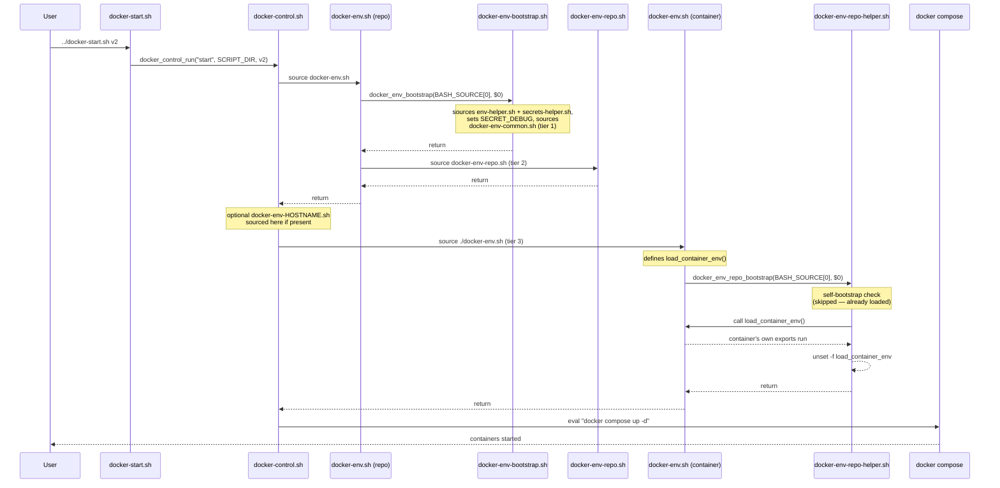

# docker-homelab: Container Start/Stop & Environment System

How docker containers actually get started and stopped across the fleet — the shared scripts, the per-host symlink layout, the environment variable tiers, and why the calling structure is shaped the way it is.

## Contents

- [Overview](#overview)
- [Directory structure](#directory-structure)
- [Host layout and symlinks](#host-layout-and-symlinks)
- [Calling flow](#calling-flow)
- [File reference](#file-reference)
- [Environment variable tiers](#environment-variable-tiers)
- [What to configure per host](#what-to-configure-per-host)
- [Design decisions](#design-decisions)
- [Known constraints](#known-constraints)
- [Adding a new container](#adding-a-new-container)
- [Adding a new docker-* repo](#adding-a-new-docker--repo)

---

## Overview

Every container's start/stop logic and environment setup boilerplate is centralized in `docker-homelab/scripts/` and `docker-homelab/docker/`, shared across every container rather than duplicated per container. A container's own folder contains almost nothing but the things that are actually unique to it — its `docker-compose.yaml` and a short list of its own environment variables and secrets.

The same shared scripts are reusable by other docker-* repos (e.g. a future `docker-homelab-private`) without copying anything — a new repo only needs its own `docker-env-repo.sh` and container folders, since everything else lives at a fixed path that every docker host already has.

## Directory structure

```
docker-homelab/                        (git repo, pulled to every docker host)
├── scripts/                           (shared across every docker-* repo)
│   ├── env-helper.sh                  # export_var
│   ├── docker-env-common.sh           # fleet-wide common vars/secrets
│   ├── docker-env-bootstrap.sh        # docker_env_bootstrap
│   └── docker-control.sh              # docker_control_run
└── docker/                            # this repo's own content
    ├── docker-paths.sh                # fixed path constants
    ├── docker-start.sh                # entry point
    ├── docker-stop.sh                 # entry point
    ├── docker-env.sh                  # repo orchestrator
    ├── docker-env-repo.sh             # repo-wide vars/secrets
    ├── docker-env-repo-helper.sh      # container-level guard + bootstrap
    ├── arr/
    │   ├── docker-compose.yaml
    │   ├── mounts/
    │   └── docker-env.sh              # this container's own vars/secrets
    └── homepage/
        ├── docker-compose.yml
        └── docker-env.sh
```

## Host layout and symlinks

Container folders aren't run from inside the git checkout directly — each host has its own working area under `/srv/servers/<hostname>/`, containing a symlink per container it actually runs, pointing back at the canonical folder in the repo:

```
/srv/servers/myhost/
├── arr -> /srv/docker-homelab/docker/arr
└── homepage -> /srv/docker-homelab/docker/homepage
```

A host only has a symlink for the containers it actually runs — not every container in the repo. This is what `cd`ing works normally through: once you `cd` into a symlinked container folder, the shell's actual working directory is resolved to the real target, so a plain relative reference like `../docker-start.sh` correctly finds the shared entry point in `docker-homelab/docker/`, regardless of which host or which symlink you went through to get there. No special handling is needed for this to work — it's ordinary symlink resolution, not something the scripts have to account for explicitly.

Typical usage:
```bash
cd /srv/servers/myhost/arr
../docker-start.sh v2
```

## Calling flow

The full sequence for `../docker-start.sh v2`, run from inside a container's folder:



`docker-stop.sh` follows the identical path, just with `docker_control_run("stop", ...)` and `docker compose down` at the end.

## File reference

| File | Lives in | Role |
|---|---|---|
| `env-helper.sh` | `scripts/` | `export_var` — export + print, single choke point for plain values |
| `docker-env-common.sh` | `scripts/` | Tier 1: vars/secrets shared by every docker-* repo |
| `docker-env-bootstrap.sh` | `scripts/` | `docker_env_bootstrap` — sourced-check, helpers, `SECRET_DEBUG` default, sources tier 1 |
| `docker-control.sh` | `scripts/` | `docker_control_run` — the actual start/stop machinery, shared across every repo |
| `docker-paths.sh` | `docker/` | Fixed path constants (`DOCKER_HOMELAB_SCRIPTS_DIR`, `SECRETS_HOMELAB_CLIENT_SCRIPTS_DIR`) |
| `docker-start.sh` / `docker-stop.sh` | `docker/` | Entry points — compute their own directory, delegate everything to `docker-control.sh` |
| `docker-env.sh` (repo level) | `docker/` | Orchestrator — bootstraps, then sources tier 2 |
| `docker-env-repo.sh` | `docker/` | Tier 2: vars/secrets shared by every container in this repo |
| `docker-env-repo-helper.sh` | `docker/` | `docker_env_repo_bootstrap` — sourced-check + self-bootstrap + runs a container's `load_container_env` |
| `docker-env.sh` (container level) | `docker/<container>/` | Tier 3: this container's own vars/secrets, defined inside `load_container_env` |
| `docker-env-<hostname>.sh` (optional) | `docker/` | Per-host override, sourced if present — see [What to configure per host](#what-to-configure-per-host) |

## Environment variable tiers

Three layers, each sourced in order, each able to override anything set before it:

1. **Fleet-wide** (`scripts/docker-env-common.sh`) — host facts (`ENV_HOSTNAME`, `ENV_LOCALIP`, `ENV_TZ`, etc.) and secrets genuinely common to every docker-* repo (the NAS backup target, the fleet-wide test-decryption secret).
2. **Repo-wide** (`docker/docker-env-repo.sh`) — vars/secrets shared by every container within this one repo, but not necessarily relevant to other docker-* repos.
3. **Container-specific** (each container's own `docker-env.sh`, inside `load_container_env`) — only what that one container needs.

An optional fourth layer, `docker-env-<hostname>.sh`, sits between tiers 2 and 3 if present, for host-specific overrides.

## What to configure per host

There's very little host-specific configuration by design — almost everything is identical across the fleet:

- **The symlinks themselves** (`/srv/servers/<hostname>/<container> -> .../docker/<container>`) are the actual per-host configuration: which symlinks exist determines which containers that host runs.
- **`docker-env-<hostname>.sh`** (optional, in `docker/`) is the mechanism for a genuine per-host override — e.g. a container that needs a different port or value on one specific host. None exist yet in the current examples; this is the file to create if that need ever comes up.
- **`docker-paths.sh`** is *not* something to vary per host — `DOCKER_HOMELAB_SCRIPTS_DIR` and `SECRETS_HOMELAB_CLIENT_SCRIPTS_DIR` are fixed, identical values everywhere, since every host pulls both repos to the same paths.
- **`SECRET_DEBUG`** defaults to `false` fleet-wide, set once in `docker-env-bootstrap.sh`. To debug on a specific run, export it before calling `docker-start.sh` (`export SECRET_DEBUG=true`) rather than editing the shared default — never commit `true` as the default.

## Design decisions

**One idiom for every sourced-check, everywhere.** `docker_control_run`, `docker_env_bootstrap`, and `docker_env_repo_bootstrap` all follow the identical shape: `source` the file that defines the function, then call the function passing your own `BASH_SOURCE[0]`/`$0` (or, for `docker_control_run`, your own computed directory) explicitly. This exists because `BASH_SOURCE[0]` evaluated *inside a function* always resolves to wherever that function was *defined*, not wherever it was called from — so a shared function could never correctly detect misuse of its *caller* without being told the caller's own values explicitly. Once one file needed this pattern, every sourced-check adopted the same shape rather than mixing idioms.

**`realpath` for directory resolution**, not `cd -- dirname -- pwd`. Converts whatever relative or symlink-laden path a file was invoked with (`BASH_SOURCE[0]`) into a canonical absolute path, so any file can reliably find its siblings regardless of how deep or indirect the invocation was.

**`load_container_env` as a callback, not inline top-level code.** A container's `docker-env.sh` *defines* this function at the top (for readability — it's the first thing you see when opening the file) but doesn't *run* it directly; the shared helper calls it only after the sourced-check has already passed, then `unset -f`s it immediately after. This keeps the guard/bootstrap machinery from running before it's supposed to, without burying the container's actual content under repeated boilerplate at the top of every file.

**Self-bootstrap via `declare -f`.** `docker_env_repo_bootstrap` checks whether `export_var`/`export_secret` already exist in the current shell before sourcing the helpers again — this is what lets any container's `docker-env.sh` be sourced completely standalone (`cd homepage && source ./docker-env.sh`) for local testing, without needing the full `docker-start.sh` chain run first.

**`export_var`/`export_secret` as choke points, not just conveniences.** Both read back the actual exported value via indirect expansion (`${!var_name}`) rather than trusting the local variable used to build the export — this means a silently-failed export (e.g. an invalid variable name) surfaces as a visibly wrong readback instead of a confidently false success message. Both also exist so that any future cross-cutting behavior (an override lookup, redirecting a specific var name elsewhere) has exactly one place to be added, without touching every container file.

**Internal/private variable naming convention.** Variables not meant to be touched directly from outside their own file use a short underscore-prefix matching the file: `_DC_` for `docker-control.sh` (e.g. `_DC_RED`), `_DEB_` for `docker-env-bootstrap.sh` (e.g. `_DEB_SECRET_DEBUG_DEFAULT`).

**Fixed paths declared once, at the top, as `readonly`/`export`ed variables** — the same convention used throughout `secrets-homelab`'s scripts, so a path never needs updating in more than one place if it ever moves.

## Known constraints

- **Container folders must be direct, flat children of `docker/`** — `docker-env-repo-helper.sh` is referenced as `../docker-env-repo-helper.sh` from every container's `docker-env.sh`, which assumes exactly one directory level of nesting. A container folder nested any deeper (e.g. `docker/media/arr/`) would resolve this path incorrectly.

## Adding a new container

1. Create `docker/<container-name>/` with a `docker-compose.yaml` and a `docker-env.sh`.
2. In `docker-env.sh`, define `load_container_env` with that container's own `export_var`/`export_secret` calls, then the same three closing lines every container file uses:
   ```bash
   SCRIPT_DIR="$(dirname "$(realpath "${BASH_SOURCE[0]}")")"
   source "$SCRIPT_DIR/../docker-env-repo-helper.sh"
   docker_env_repo_bootstrap "${BASH_SOURCE[0]}" "${0}"
   ```
3. Symlink it into whichever host(s) will run it: `/srv/servers/<hostname>/<container-name> -> /srv/docker-homelab/docker/<container-name>`.

## Adding a new docker-* repo

A new repo (e.g. `docker-homelab-private`) needs only:
- Its own `docker/docker-paths.sh`, `docker-start.sh`, `docker-stop.sh`, `docker-env.sh`, `docker-env-repo.sh`, and `docker-env-repo-helper.sh` — these can be copied across largely unchanged, since none of their content is specific to `docker-homelab` itself.
- Its own container folders.

Everything under `scripts/` is already shared and requires no changes or duplication.


# docker-homelab


## Documentation

Per-service architecture and operational docs live under `docs/`:

- [`docs/dns/`](docs/dns/) — DNS server (Technitium) high-availability and
  load-balancing setup (keepalived VRRP + IPVS). See
  [`DNS_HA_LB_ARCHITECTURE.md`](docs/dns/DNS_HA_LB_ARCHITECTURE.md) for
  the full architecture and debug reference,
  [`POST_DEPLOYMENT_CHECKLIST.md`](docs/dns/POST_DEPLOYMENT_CHECKLIST.md)
  for validating a deployment end to end, and
  [`TECHNITIUM_TOKEN_SETUP.md`](docs/dns/TECHNITIUM_TOKEN_SETUP.md) for
  generating and vaulting the API token the health check depends on.

## License

This project is licensed under the MIT License. See the [LICENSE](LICENSE) file for details.
