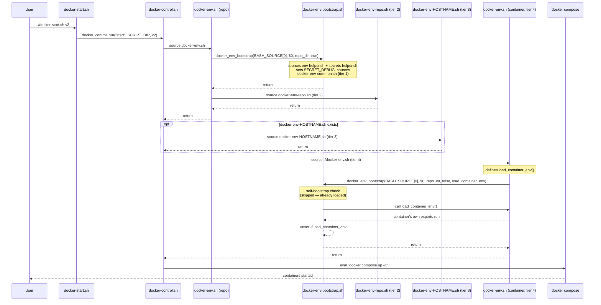

# docker-homelab


How docker containers actually get started and stopped across the fleet — the shared scripts, the per-host symlink layout, the environment variable tiers, and why the calling structure is shaped the way it is.

## Contents

- [Overview](#overview)
- [Directory structure](#directory-structure)
- [Host layout and symlinks](#host-layout-and-symlinks)
- [Calling flow](#calling-flow)
- [File reference](#file-reference)
- [Environment variable tiers](#environment-variable-tiers)
- [What to configure per host](#what-to-configure-per-host)
- [Design decisions](#design-decisions)
- [Known constraints](#known-constraints)
- [Adding a new container](#adding-a-new-container)
- [Adding a new homelab docker repo](#adding-a-new-homelab-docker-repo)

---

## Overview

Every container's start/stop logic and environment setup boilerplate is centralised in `docker-homelab/scripts/` and `docker-homelab/docker/`, shared across every container rather than duplicated per container. A container's own folder contains almost nothing but the things that are actually unique to it — its `docker-compose.yaml`, its own data mounts, and a short list of its own environment variables and secrets.

The same shared scripts are reusable by other homelab docker repos (e.g. a future `docker-homelab-prv`) without copying anything — a new repo only needs its own `docker-env-repo.sh` and container folders, since everything else lives at a fixed path that every docker host already has. Naming follows the wider convention used across the homelab: `*-homelab` (`docker-homelab`, `docker-homelab-prv`, `ansible-homelab`, `secrets-homelab`).

## Directory structure

This is the complete structure — the containers shown are just examples; there are many more in practice.

```
docker-homelab/                        (git repo, pulled to every docker host)
├── servers/
│   └── [hostname]/
│       ├── container-1                # symlink back to docker/container-1 — container started from here
│       └── container-2                # symlink back to docker/container-2 — container started from here
├── scripts/                           (shared across every *-homelab docker repo)
│   ├── env-helper.sh                  # environment variable exporter
│   ├── docker-env-common.sh           # fleet-wide common vars/secrets (tier 1)
│   ├── docker-env-bootstrap.sh        # docker environment bootstrap
│   └── docker-control.sh              # control mechanism for the container — start / stop / dryrun
└── docker/                            # this repo's own content
    ├── docker-config.sh               # configuration file (paths, defaults)
    ├── docker-start.sh                # entry point
    ├── docker-stop.sh                 # entry point
    ├── docker-env.sh                  # repo orchestrator
    ├── docker-env-repo.sh             # repo-wide vars/secrets (tier 2)
    ├── docker-env-<hostname>.sh       # optional per-host overrides (tier 3)
    ├── container-1/
    │   ├── docker-compose.yaml
    │   ├── data/
    │   │   ├── host/                  # host mount point for the container (not committed)
    │   │   └── common/                # common data mount point (committed)
    │   └── docker-env.sh              # this container's own vars/secrets (tier 4)
    └── container-2/
        ├── docker-compose.yaml
        ├── data/
        │   ├── host/
        │   └── common/
        └── docker-env.sh
```

## Host layout and symlinks

`servers/<hostname>/` holds one symlink per container that host actually runs, each pointing back at the canonical folder under `docker/`:

```
servers/myhost/
├── container-1 -> ../../docker/container-1
└── container-2 -> ../../docker/container-2
```

A host only has a symlink for the containers it actually runs — not every container in the repo. This is what lets ordinary relative paths work: once you `cd` into a symlinked container folder, the shell's actual working directory resolves to the real target, so a plain relative reference like `../docker-start.sh` correctly finds the shared entry point in `docker-homelab/docker/`, regardless of which host or which symlink you went through to get there. No special handling is needed for this to work — it's ordinary symlink resolution, not something the scripts have to account for explicitly.

Typical usage:
```bash
cd servers/myhost/container-1
../docker-start.sh v2
```

## Calling flow

The full sequence for `../docker-start.sh v2`, run from inside a container's folder:



`docker-stop.sh` follows the identical path, just with `docker_control_run("stop", ...)` and `docker compose down` at the end.

## File reference

| File | Lives in | Role |
|---|---|---|
| `env-helper.sh` | `scripts/` | `export_var` — export + print, single choke point for plain values |
| `docker-env-common.sh` | `scripts/` | Tier 1: vars/secrets shared by every `*-homelab` docker repo |
| `docker-env-bootstrap.sh` | `scripts/` | `docker_env_bootstrap` — the single sourced-check + bootstrap function, used by both the repo orchestrator and every container's `docker-env.sh` |
| `docker-control.sh` | `scripts/` | `docker_control_run` — the actual start/stop machinery, shared across every repo |
| `docker-config.sh` | `docker/` | Single point of configuration — fixed paths and default settings |
| `docker-start.sh` / `docker-stop.sh` | `docker/` | Entry points — compute their own directory, delegate everything to `docker-control.sh` |
| `docker-env.sh` (repo level) | `docker/` | Orchestrator — bootstraps (tier 1), then sources tier 2 |
| `docker-env-repo.sh` | `docker/` | Tier 2: vars/secrets shared by every container in this repo |
| `docker-env-<hostname>.sh` | `docker/` | Tier 3: per-host override, sourced if present |
| `docker-env.sh` (container level) | `docker/<container>/` | Tier 4: this container's own vars/secrets, defined inside `load_container_env` |

## Environment variable tiers

Four tiers, sourced in a fixed order, each able to override anything set before it. Tier 3 is always considered — it's a formal part of the sequence, sourced whenever the file for the current host happens to exist, not an ad hoc extra step:

1. **Common** (`scripts/docker-env-common.sh`) — host facts (`ENV_HOSTNAME`, `ENV_LOCALIP`, `ENV_TZ`, etc.) and secrets genuinely common to every `*-homelab` docker repo.
2. **Repo** (`docker/docker-env-repo.sh`) — vars/secrets shared by every container within this one repo, but not necessarily relevant to other repos.
3. **Host** (`docker/docker-env-<hostname>.sh`, optional) — overrides specific to one host. Sourced if the file exists for the current `$HOSTNAME`; skipped otherwise. No host-specific overrides exist yet in the current examples — this is the file to create when that need comes up.
4. **Container** (each container's own `docker-env.sh`, inside `load_container_env`) — only what that one container needs.

## What to configure per host

There's very little host-specific configuration by design — almost everything is identical across the fleet:

- **The symlinks under `servers/<hostname>/`** are the actual per-host configuration: which symlinks exist determines which containers that host runs.
- **`docker-env-<hostname>.sh`** (tier 3, optional) is the mechanism for a genuine per-host override — e.g. a container that needs a different port or value on one specific host.
- **`docker-config.sh`** is *not* something to vary per host — its paths and defaults are fixed, identical values everywhere, since every host pulls both repos to the same paths.
- **`SECRET_DEBUG`** defaults to `SECRET_DEBUG_DEFAULT` (set once in `docker-config.sh`, currently `false`). To debug on a specific run, export it before calling `docker-start.sh` (`export SECRET_DEBUG=true`) rather than editing the shared default — never commit `true` as the default.

## Design decisions

**One idiom for every sourced-check, everywhere.** `docker_control_run` and `docker_env_bootstrap` both follow the identical shape: `source` the file that defines the function, then call the function passing your own `BASH_SOURCE[0]`/`$0` (or, for `docker_control_run`, your own computed directory) explicitly. This exists because `BASH_SOURCE[0]` evaluated *inside a function* always resolves to wherever that function was *defined*, not wherever it was called from — so a shared function could never correctly detect misuse of its *caller* without being told the caller's own values explicitly.

**One bootstrap function for both the repo level and container level.** `docker_env_bootstrap` is parameterized (`repo_dir`, `source_common`, `callback_fn`) rather than duplicated into a separate function per tier — the guard and self-bootstrap logic are identical either way; only the location of `docker-config.sh` relative to the caller, whether tier 1 needs sourcing, and whether a callback needs running actually differ.

**Self-bootstrap restores functions only, never tier 1 as a side effect.** If `export_var`/`export_secret` are missing, `docker_env_bootstrap` sources just enough to define them again — it deliberately does not also pull in tier 1, even on a cold shell. This keeps a standalone test of one container's `docker-env.sh` scoped to that container's own vars/secrets; tier 1 loading is controlled solely by the explicit `source_common` argument.

**`realpath` for directory resolution**, not `cd -- dirname -- pwd`. Converts whatever relative or symlink-laden path a file was invoked with (`BASH_SOURCE[0]`) into a canonical absolute path, so any file can reliably find its siblings regardless of how deep or indirect the invocation was.

**`load_container_env` as a callback, specifically at the container tier — not applied to the other tiers.** A container's `docker-env.sh` has to hold both the guard/bootstrap call and its own content in one file; defining the content as a function (readable at the top) that's only *run* after the guard has passed (via the callback) resolves that tension. Tiers 1–3 don't have this conflict — none of them contain guard logic themselves, so their content is already safe to leave as plain top-level code with nothing to protect it from running too early. Wrapping them in the same callback pattern would add indirection without solving anything.

**`export_var`/`export_secret` as intercept points, not just conveniences.** Both read back the actual exported value via indirect expansion (`${!var_name}`) rather than trusting the local variable used to build the export — this means a silently-failed export (e.g. an invalid variable name) surfaces as a visibly wrong readback instead of a confidently false success message. Both also exist so that any future cross-cutting behavior (an override lookup, redirecting a specific var name elsewhere) has exactly one place to be added, without touching every container file.

**Internal/private variable naming convention.** A variable prefixed with an underscore (e.g. `_DC_RED` in `docker-control.sh`) signals "internal, not meant to be touched from outside this file." Settings meant to actually be edited — the contents of `docker-config.sh` — deliberately do NOT use this prefix, since it would send the opposite signal to the one intended.

**Fixed paths and defaults declared once, in `docker-config.sh`**, as `export`ed variables — the same convention used throughout `secrets-homelab`'s scripts, so a value never needs updating in more than one place if it ever changes.

## Known constraints

- **Container folders must be direct, flat children of `docker/`** — every container's `docker-env.sh` computes its repo directory as one level up from its own location. A container folder nested any deeper (e.g. `docker/media/container-1/`) would resolve this incorrectly.

## Adding a new container

1. Create `docker/<container-name>/` with a `docker-compose.yaml`, a `data/host/` and `data/common/` mount structure, and a `docker-env.sh`.
2. In `docker-env.sh`, define `load_container_env` with that container's own `export_var`/`export_secret` calls, then the same closing lines every container file uses:
   ```bash
   CONTAINER_DIR="$(dirname "$(realpath "${BASH_SOURCE[0]}")")"
   source "$CONTAINER_DIR/../docker-config.sh"
   source "$DOCKER_HOMELAB_SCRIPTS_DIR/docker-env-bootstrap.sh"
   docker_env_bootstrap "${BASH_SOURCE[0]}" "${0}" "$CONTAINER_DIR/.." false load_container_env
   ```
3. Symlink it into whichever host(s) will run it: `servers/<hostname>/<container-name> -> ../../docker/<container-name>`.

## Adding a new homelab docker repo

A new repo (e.g. `docker-homelab-prv`) needs only:
- Its own `docker/docker-config.sh`, `docker-start.sh`, `docker-stop.sh`, `docker-env.sh`, and `docker-env-repo.sh` — these can be copied across largely unchanged, since none of their content is specific to `docker-homelab` itself.
- Its own `servers/` and container folders.

Everything under `scripts/` is already shared and requires no changes or duplication.

## License

This project is licensed under the MIT License. See the [LICENSE](LICENSE) file for details.
