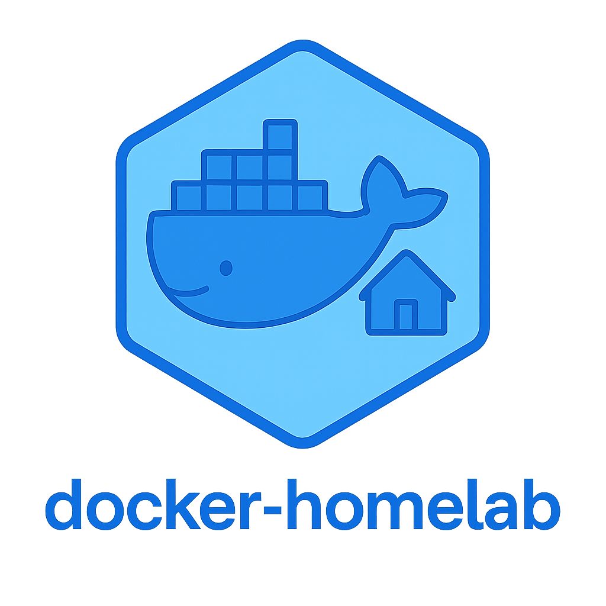

# docker-homelab

## Documentation

Per-service architecture and operational docs live under `docs/`:

- [`docs/dns/`](docs/dns/) — DNS server (Technitium) high-availability and
  load-balancing setup (keepalived VRRP + IPVS). See
  [`DNS_HA_LB_ARCHITECTURE.md`](docs/dns/DNS_HA_LB_ARCHITECTURE.md) for
  the full architecture and debug reference,
  [`POST_DEPLOYMENT_CHECKLIST.md`](docs/dns/POST_DEPLOYMENT_CHECKLIST.md)
  for validating a deployment end to end, and
  [`TECHNITIUM_TOKEN_SETUP.md`](docs/dns/TECHNITIUM_TOKEN_SETUP.md) for
  generating and vaulting the API token the health check depends on.

## License

This project is licensed under the MIT License. See the [LICENSE](LICENSE) file for details.
