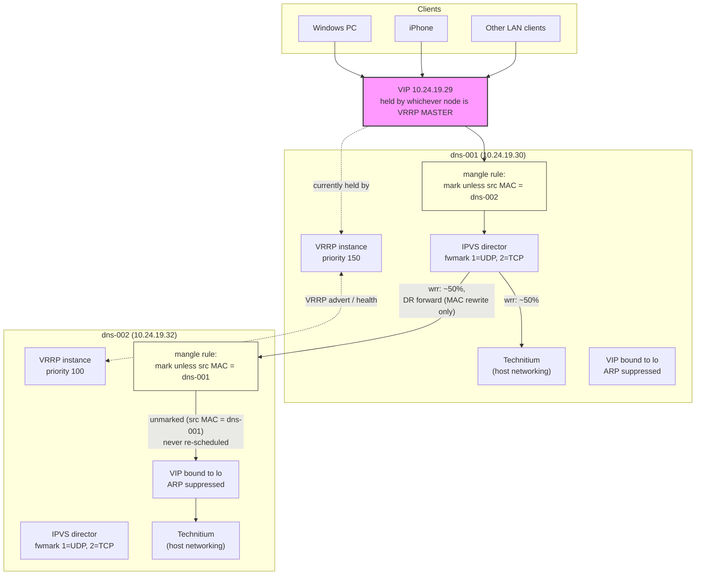
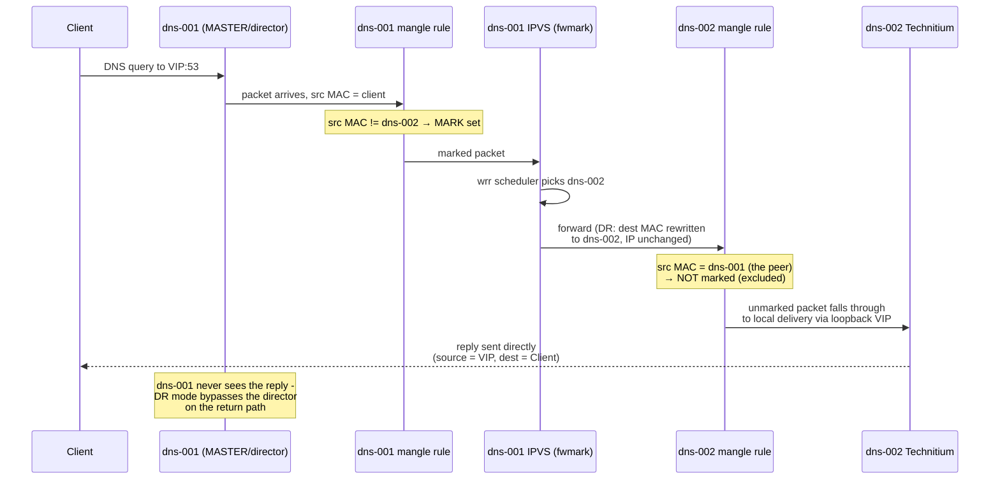
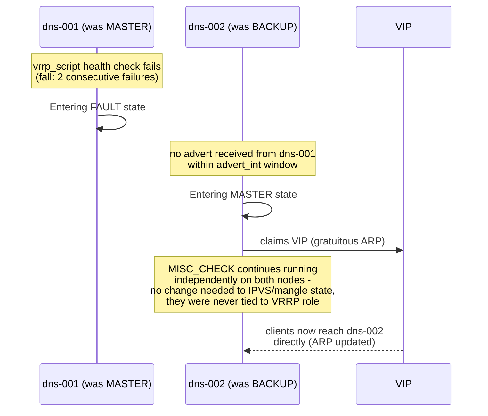

# DNS High-Availability + Load Balancing — Architecture & Debug Reference

## Overview

`dns-001` and `dns-002` run Technitium DNS (Docker, host networking) and
together present a single virtual IP (`10.24.19.29`) that DNS clients
query. The pair provides two things simultaneously:

1. **VRRP failover** (keepalived) — one node always holds the VIP; if it
   fails, the other takes over automatically, typically within a few
   seconds.
2. **IPVS load balancing** (LVS-DR mode, also keepalived) — whichever node
   currently holds the VIP also acts as a *director*, splitting incoming
   query traffic across both nodes rather than always answering locally.
   Each node independently health-checks the other and pulls it from
   rotation if its DNS stops answering.

Both nodes run identical roles simultaneously: each is a VRRP peer, a
potential director, and a real server in the load-balanced pool.

## Topology



## Sequence: a normal query, load-balanced to the peer



## Sequence: VRRP failover + IPVS director handoff



## Why it's built this way (the non-obvious parts)

### Docker must use host networking

Docker's default bridge networking publishes container ports via iptables
DNAT rules matching `ADDRTYPE dst-type LOCAL` — meaning *any* locally-owned
IP, not just the container host's original address. The moment the VIP
becomes locally bound (via VRRP or the DR-mode loopback binding below),
Docker's DNAT rule intercepts VIP-addressed traffic and delivers it
straight to the container, before IPVS's own kernel hook ever gets a
chance to schedule it. This was the root cause of hours of "why won't load
balancing distribute traffic" debugging — confirmed directly via
`iptables -t nat -L DOCKER -n -v`. Host networking removes Docker's
NAT/port-publishing layer entirely, letting IPVS see and schedule the
traffic correctly.

### LVS-DR mode and the loopback VIP binding

Direct Routing (DR) mode never rewrites IP headers — only the destination
MAC address. This means the response can go directly from whichever real
server handled the query straight back to the client, without passing
back through the director. It's what preserves the real client source IP
(unlike a reverse proxy, which would make every query look like it came
from the proxy itself). For a real server to accept and answer VIP-
addressed traffic without "owning" the VIP on its main interface, the VIP
is bound to `lo` (loopback) with ARP suppressed (`arp_ignore`/
`arp_announce` sysctls) — so the node accepts the traffic locally but
never announces itself as the VIP's owner via ARP.

### The dual-director ping-pong loop, and why it needs mangle rules

keepalived normally activates a `virtual_server`'s IPVS rules on **every**
node that has that block configured, regardless of VRRP state — not just
the current MASTER. Since both `dns-001` and `dns-002` are always real
servers *and* always potential directors, without any additional
protection both nodes independently run an active IPVS scheduler for the
same VIP simultaneously. If the current director forwards a packet to the
peer, that packet is still addressed to the VIP (DR mode never rewrites
IPs) — so the peer's own IPVS instance intercepts it a second time and can
reschedule it right back. This produces an **unbounded** MAC-layer
ping-pong loop, confirmed directly via packet capture: DR mode never
decrements IP TTL, so nothing kills the loop on its own once it starts.

The fix: an `iptables mangle` rule on each node marks VIP-destined traffic
**unless** its source MAC belongs to the peer real server. `keepalived.conf`
then uses `fwmark`-based `virtual_server` blocks instead of matching the
VIP/port directly — so a packet the peer already forwarded (unmarked on
arrival) never matches this node's own virtual_server and never gets
rescheduled. Genuinely new client traffic still gets marked and scheduled
normally. Critically, this preserves keepalived's own continuous
`MISC_CHECK` health monitoring on both nodes — an earlier approach that
tried to solve this by disabling IPVS entirely on the non-MASTER node
(via a notify-script hook) was rejected specifically because it lost
continuous health awareness between VRRP transitions.

### Why the health check is a real script file, not inline in keepalived.conf

`enable_script_security` causes keepalived to exec check commands directly
rather than via a shell. An inline shell pipeline (e.g. `curl ... | grep
...`) written directly in `keepalived.conf` has its pipe character passed
as a literal argument to the binary instead of being interpreted — silently
breaking the check (it always "succeeds" regardless of the actual
response, or errors out in a way that's easy to misread as a real failure).
Wrapping the command in a real script file with its own `#!/bin/bash`
shebang avoids this, since the shell interpretation happens inside the
script's own execution, not in how keepalived invokes it.

### The health check is fully generic — nothing in the role knows about DNS or Technitium

`check.sh.j2` takes two positional arguments — `TARGET` (which node/address
to check) and an optional `EXTRA_ARG` (anything the actual check command
needs beyond the target, e.g. an API token) — and just runs whatever
`keepalived_check_command` says, substituting `${TARGET}`/`${TOKEN}` (a
shell variable inside the rendered script, not an Ansible var) into it.
Two role-level vars drive the args every invocation gets:

- `keepalived_check_self_target` (role default: `127.0.0.1`) — what the
  VRRP self-check passes as `TARGET`. Correct for virtually any service,
  kept as an overridable default rather than hardcoded in the template.
- `keepalived_check_extra_arg` (role default: `""`, empty) — passed as the
  second argument to every check invocation. Most services need nothing
  here; this DNS pool sets it (per-group, in `keepalived_dns_target`'s
  vars) to carry a Technitium API token.

For IPVS `MISC_CHECK`, each real server needs *its own* extra arg, not
necessarily this node's own — `keepalived_real_server_extra_args` (built
in `tasks/main.yaml` via a `hostvars` cross-lookup, same technique as the
peer-MAC derivation) supplies that per-IP. The role has no idea this dict
happens to hold identical values for every entry in this pool right now
(see the token-sharing note below) — it works exactly the same whether the
values are identical or genuinely distinct per host.

**What makes this DNS-specific lives entirely in `group_vars/
keepalived_dns_target.yaml` and the vault, not in the role**:

```yaml
keepalived_check_command: >-
  /usr/bin/curl -sf --max-time {{ keepalived_check_timeout }}
  "http://${TARGET}:5380/api/dnsClient/healthCheck?token=${TOKEN}"
  | grep -Eq '"status"[[:space:]]*:[[:space:]]*"ok"'
```

### Why the health check uses Technitium's API, not a real DNS query

An earlier version used `dig` directly (over TCP, to correctly detect a
frozen/paused container — see below). That worked, but generated a real,
loggable DNS query at check frequency — across the self-check and every
real-server `MISC_CHECK`, that added up to a continuous stream of
query-log entries with zero informational value, confirmed directly during
testing (visible as a wall of `NXDomain`/repeated-name entries in
Technitium's own query log). Technitium documents a dedicated
`/api/dnsClient/healthCheck` endpoint specifically for this purpose —
confirms the server process is running and able to resolve names, without
creating a query-log entry at all.

Trade-offs of the switch, worth knowing:
- Requires an API token (`Authorization` via `?token=`), so there's now a
  credential to manage — see the "API token" section below.
- It's HTTP (port 5380), not DNS traffic — the "frozen container" failure
  mode had to be re-verified for this transport specifically (see next
  section), since the original TCP-vs-UDP reasoning was DNS-specific.

### Why `--max-time` on the curl check is mandatory, not optional

Same failure mode as the earlier `dig`-based check, re-confirmed for HTTP:
a frozen/paused Technitium container can still accept the TCP connection
via Docker's port-forwarding layer even when the application itself isn't
responding — a `curl` call with no timeout hangs indefinitely waiting for
a response that will never come, rather than failing. `--max-time
{{ keepalived_check_timeout }}` bounds the whole request (connect +
response), confirmed directly via a `docker pause` test during
development: without the flag, the check hung; with it, it correctly
timed out and reported unhealthy.

### The Technitium API token — generation and sharing behavior

Generated via Technitium's `createToken` API using the existing `admin`
account (deliberately not a separate low-privilege account — the extra
account/credential to maintain wasn't worth it for a home LAN; the token
does have full admin API scope as a result, worth knowing if this pattern
is ever reused somewhere with different stakes).

**Confirmed via direct testing**: Technitium clusters/syncs API tokens
across all nodes in the cluster — a token generated on one node works
identically when calling any other node's API. Because of this, the
DNS pool uses a single shared token rather than one per node:

- `group_vars/all/vault.yaml` (encrypted) holds one entry:
  `keepalived_technitium_api_token_clustered`
- Both `dns-001` and `dns-002`'s `host_vars` explicitly reference it:
  `keepalived_check_extra_arg: "{{ keepalived_technitium_api_token_clustered }}"`

The explicit per-host reference (rather than relying on implicit
group/vault auto-merge) is deliberate — it keeps each host_vars file a
complete, self-describing picture of what that host uses, rather than
requiring a reader to already know a value comes from `group_vars/all/`.
If Technitium's clustering behavior ever changes and tokens genuinely
diverge per node, only the host_vars reference needs to change (to point
at a distinct per-host vault entry instead) — nothing in the role does.

### Check timing — tuned deliberately, not left at defaults

`keepalived_check_interval: 3`, `keepalived_check_timeout: 2`,
`keepalived_check_fall: 2`, `keepalived_check_rise: 2` (role defaults).
`timeout` is kept below `interval` (2s vs 3s) so a check can't still be
running when the next one would start. Worst-case detection time is
`interval × fall` ≈ 6 seconds — a deliberate choice to favor a small
buffer against false-positive failover (e.g. a momentary blip) over the
fastest possible failover; acceptable for a home network where a
few-second gap in DNS availability is a non-issue given client-side
retry/fallback behavior anyway. Widen `fall` (not `interval`) first if
false-positive failovers are ever observed in practice — it adds
detection latency without weakening the check itself.

## Variable / config ownership map


| Concern | Lives in |
|---|---|
| This node's identity (interface, priority, own IP, peer list, own health-check extra arg) | `inventories/local/host_vars/dns-00N...yaml` |
| Pool-wide facts that must match across every node (VIP, router ID, real server list, health check command) | `inventories/local/group_vars/keepalived_dns_target.yaml` |
| Generic role behavior/timing, and the generic check-script slots (`keepalived_check_self_target`, `keepalived_check_extra_arg` defaults) — deliberately DNS-agnostic | `roles/keepalived/defaults/main.yaml` |
| The actual Technitium API token value | `group_vars/all/vault.yaml` (encrypted, one shared entry — see the API token section above) |
| Admin account identity | `group_vars/all/admin-user.yaml` |

## Debug command reference — mapped to each stage

Each stage below corresponds to a box/arrow in the topology diagram or a
step in one of the sequence diagrams above, so you can isolate exactly
where in the pipeline something is going wrong rather than guessing.

### Stage 0 — Who currently holds the VIP (topology: `VIP -.currently held by.->`)

```bash
# run on both nodes; exactly one should show the VIP on ens18
ip addr show ens18 | grep 10.24.19.29

# both nodes should show it bound to lo too (DR-mode real-server binding,
# independent of who's MASTER)
ip addr show lo | grep 10.24.19.29
```

### Stage 1 — Is keepalived running and what does it believe its own state is

```bash
sudo systemctl status keepalived
sudo journalctl -u keepalived -f
# watch for: "Entering MASTER STATE" / "Entering BACKUP STATE" /
# "VRRP_Script(chk_service) succeeded" or "failed"
```

### Stage 2 — Mangle rule (topology: `D1_MANGLE` / `D2_MANGLE` boxes)

```bash
# on both nodes - confirm both UDP and TCP rules are present, and check
# whether pkts/bytes counters are incrementing (proof traffic is actually
# hitting the rule, not just that it exists)
sudo iptables -t mangle -L PREROUTING -n -v --line-numbers
```
If a node's rule shows 0 packets ever, it has never received forwarded
traffic from its peer — either it's never been the non-director side, or
something upstream (Stage 0/1) isn't working.

### Stage 3 — IPVS scheduling decision (topology: `D1_IPVS` / `D2_IPVS`)

```bash
# current pool state: which real servers are active, at what weight
sudo ipvsadm -L -n

# cumulative connection counts per real server - the definitive answer to
# "is this actually distributing across both nodes" (don't rely on
# eyeballing packet captures for this, connection tracking noise makes it
# easy to misread - see the "why not tcpdump for this" note below)
sudo ipvsadm -L -n --stats
```
Take two snapshots a minute or so apart under real traffic and diff the
`Conns` column for each real server - both should be climbing.

### Stage 4 — DR forward + local delivery on the peer (sequence diagram: `mangle2->>tech2`)

```bash
# confirm Technitium is actually listening on the real interface, not
# just via Docker's old published-port mechanism
sudo ss -tulnp | grep :53

# confirm Docker isn't intercepting VIP traffic before it reaches this
# point at all - should show NO rule matching dpt:53
sudo iptables -t nat -L DOCKER -n -v
```

### Stage 5 — Health check (drives both Stage 1's vrrp_script and Stage 3's MISC_CHECK)

```bash
# manually run the exact check keepalived uses, against a specific node -
# needs the same extra arg (Technitium API token) keepalived passes it;
# grab the current value from the rendered keepalived.conf if unsure:
grep -A1 "misc_path" /etc/keepalived/keepalived.conf

/etc/keepalived/scripts/check.sh 10.24.19.30 YOUR_TOKEN_HERE
echo "exit: $?"     # 0 = healthy, non-zero = would be marked down

# confirm the token check is genuinely doing its job (not just "server
# reachable") - an invalid token should fail cleanly, not hang or false-pass:
/etc/keepalived/scripts/check.sh 10.24.19.30 clearly-wrong-token
echo "exit: $?"     # should be non-zero
```

### Stage 6 — Watching a query flow through every stage at once

Use a unique test domain (not a real one) so it's unambiguous in the
capture, and run this **simultaneously on both nodes** — DR mode means a
reply from the non-director node never passes back through the director,
so you need both vantage points to see the complete round trip (this is
also why `tcpdump` alone is a poor tool for the "is it actually load
balancing" question — a single node's capture is structurally unable to
show you the whole picture; use Stage 3's `ipvsadm --stats` for that
question instead, and reserve `tcpdump` for tracing one specific
problematic exchange):

```bash
sudo tcpdump -i ens18 -e -n host 10.24.19.29 and port 53
```
`-e` shows MAC addresses, which is how you distinguish "genuinely new
client traffic" from "a packet the peer just forwarded" (source MAC =
peer's real interface MAC) when reading the capture.

### Simulating failures (exercises the full failover + rebalancing path)

**Simulate one node's DNS going unhealthy without stopping the whole
container** (exercises Stage 5 → Stage 3's MISC_CHECK path, independent
of VRRP):
```bash
docker pause dns-server   # on the node you want to fail
sleep 15
sudo ipvsadm -L -n        # its weight should now show 0, automatically
docker unpause dns-server
sleep 15
sudo ipvsadm -L -n        # weight should return to normal, automatically
```

**Force a full VRRP failover** (exercises the second sequence diagram,
Stage 0 → Stage 1 end to end):
```bash
sudo systemctl stop keepalived   # on the current MASTER
# on the other node, watch for the takeover:
sudo journalctl -u keepalived -f
ip addr show | grep 10.24.19.29   # confirm VIP moved to this node
```

## Scaling beyond two nodes

Not currently planned, but the role was designed with this in mind rather
than hardcoded to exactly two nodes. What's confirmed to generalize versus
what's untested if a third node were ever added:

**Designed to scale, but only validated at N=2:**
- `keepalived_dns_nodes` / `keepalived_unicast_peers` — adding a third IP
  to the group var automatically updates every existing node's peer list
  (via the `reject('equalto', ...)` filter), no manual edits needed.
- `keepalived_real_servers` / the `real_server` loop in
  `keepalived.conf.j2` — already list-driven, adding a third entry just
  adds a third `real_server` block on every node.
- The mangle-rule peer-MAC exclusion (`mangle-rules.sh.j2`) — the Jinja
  loop already chains one `-m mac ! --mac-source` clause per peer
  (ANDed together), so a third node would correctly produce two exclusion
  clauses instead of one. This is generic by design, but has only ever
  been exercised with exactly one peer (N=2) - not proven at N=3.

**Would need a deliberate decision, not automatic:**
- Whether a third node should be a full director+real-server (like
  dns-001/dns-002) or a VRRP-only fallback with
  `keepalived_load_balancer_enabled: false` overridden in its own
  host_vars (lower VRRP priority, never receives IPVS-forwarded traffic,
  none of the DR-mode/mangle/loopback machinery applied to it at all).
  The role supports either via existing vars - nothing new to build for
  this specific choice, it's just not automatic either way.

**Before trusting N=3 in practice:** run a `--check` dry-run with a third
host stubbed into the inventory and inspect the rendered
`keepalived_peer_macs` and `keepalived.conf` on all three nodes before
applying for real - this exact scenario has not been run through live
Ansible.
